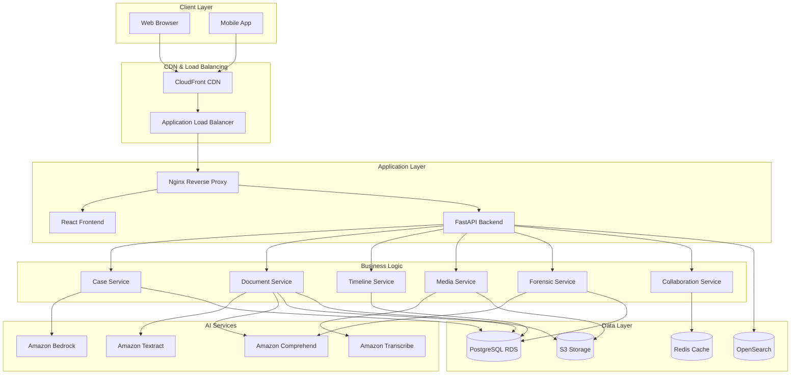

# Design Document

## Overview

The Court Case Management System is a cloud-native legal platform built on AWS that combines traditional case management with advanced AI capabilities and forensic analysis. The system follows a microservices architecture with clear separation between the presentation layer (React frontend), business logic layer (FastAPI backend), and data layer (PostgreSQL with S3 storage).

The design emphasizes security, scalability, and legal compliance while providing intuitive interfaces for legal professionals. Key architectural decisions include using AWS managed services for AI capabilities, implementing comprehensive audit trails for legal compliance, and designing for horizontal scalability to handle varying workloads.

## Architecture

### High-Level Architecture



### Service Architecture

The system is organized into distinct services, each responsible for specific business domains:

- **Case Service**: Core case management, metadata, and lifecycle
- **Document Service**: File upload, AI analysis, and text extraction
- **Timeline Service**: Event management, evidence pinning, and visualization
- **Media Service**: Audio/video processing, streaming, and forensic integrity
- **Forensic Service**: Digital communication analysis and pattern detection
- **Collaboration Service**: Real-time sharing, permissions, and notifications

## Components and Interfaces

### Frontend Components

**Timeline Builder Component**

- Interactive drag-and-drop timeline interface
- Evidence attachment with relevance scoring
- Real-time collaboration indicators
- Export functionality (PDF, PNG, JSON)

**Forensic Analysis Dashboard**

- Communication network visualization
- Sentiment analysis charts
- Pattern detection alerts
- Search and filtering interface

**Media Evidence Player**

- Streaming video/audio player with range requests
- Annotation and timestamp marking
- Secure sharing controls
- Chain of custody logging

### Backend Services

**Case Management API**

```python
class CaseService:
    async def create_case(case_data: CaseCreate) -> Case
    async def update_case(case_id: UUID, updates: CaseUpdate) -> Case
    async def get_case_timeline(case_id: UUID) -> List[TimelineEvent]
    async def generate_case_insights(case_id: UUID) -> CaseInsights
```

**Document Analysis API**

```python
class DocumentService:
    async def upload_document(file: UploadFile, case_id: UUID) -> Document
    async def analyze_document(document_id: UUID) -> DocumentAnalysis
    async def search_documents(query: str, case_id: UUID) -> List[Document]
    async def extract_timeline_events(document_id: UUID) -> List[TimelineEvent]
```

**Timeline Management API**

```python
class TimelineService:
    async def create_event(event_data: TimelineEventCreate) -> TimelineEvent
    async def pin_evidence(event_id: UUID, evidence_id: UUID, relevance: float) -> EvidencePin
    async def export_timeline(timeline_id: UUID, format: ExportFormat) -> ExportResult
    async def collaborate_timeline(timeline_id: UUID, user_id: UUID, permissions: Permissions) -> CollaborationSession
```

**Media Processing API**

```python
class MediaService:
    async def upload_media(file: UploadFile, case_id: UUID) -> MediaEvidence
    async def stream_media(media_id: UUID, range_header: str) -> StreamingResponse
    async def generate_thumbnails(media_id: UUID) -> List[Thumbnail]
    async def create_secure_link(media_id: UUID, expiration: datetime, view_limit: int) -> SecureLink
```

**Forensic Analysis API**

```python
class ForensicService:
    async def upload_forensic_data(file: UploadFile, source_type: ForensicSourceType) -> ForensicSource
    async def analyze_communications(source_id: UUID) -> CommunicationAnalysis
    async def generate_network_graph(source_id: UUID) -> NetworkGraph
    async def detect_patterns(source_id: UUID) -> List[PatternAlert]
```

### Data Models

**Core Entities**

```python
class Case(BaseModel):
    id: UUID
    case_number: str
    title: str
    description: str
    case_type: CaseType
    status: CaseStatus
    client_id: UUID
    created_at: datetime
    updated_at: datetime
    metadata: Dict[str, Any]

class TimelineEvent(BaseModel):
    id: UUID
    case_id: UUID
    title: str
    description: str
    event_type: EventType
    event_date: datetime
    location: Optional[str]
    participants: List[str]
    evidence_pins: List[EvidencePin]
    created_by: UUID
    created_at: datetime

class Document(BaseModel):
    id: UUID
    case_id: UUID
    filename: str
    file_path: str
    file_size: int
    mime_type: str
    extracted_text: Optional[str]
    ai_summary: Optional[str]
    entities: List[ExtractedEntity]
    upload_date: datetime
    uploaded_by: UUID

class MediaEvidence(BaseModel):
    id: UUID
    case_id: UUID
    filename: str
    file_path: str
    file_size: int
    duration: Optional[float]
    format: str
    thumbnails: List[str]
    transcription: Optional[str]
    chain_of_custody: List[CustodyEntry]
    upload_date: datetime
    uploaded_by: UUID

class ForensicSource(BaseModel):
    id: UUID
    case_id: UUID
    source_type: ForensicSourceType
    filename: str
    file_path: str
    analysis_status: AnalysisStatus
    message_count: int
    participant_count: int
    date_range: DateRange
    analysis_results: Optional[ForensicAnalysis]
    upload_date: datetime
    uploaded_by: UUID
```

### Integration Interfaces

**AWS Service Integration**

```python
class AWSTextractClient:
    async def analyze_document(document_path: str) -> TextractResponse
    async def extract_forms(document_path: str) -> FormExtractionResponse

class AWSComprehendClient:
    async def detect_entities(text: str) -> EntityDetectionResponse
    async def analyze_sentiment(text: str) -> SentimentResponse
    async def detect_key_phrases(text: str) -> KeyPhraseResponse

class AWSBedrockClient:
    async def generate_case_summary(case_data: str) -> str
    async def suggest_timeline_events(document_text: str) -> List[TimelineEventSuggestion]
    async def analyze_legal_risk(case_context: str) -> RiskAssessment
```

## Data Models

### Database Schema Design

The system uses PostgreSQL with JSONB columns for flexible metadata storage and full-text search capabilities.

**Primary Tables:**

- `cases` - Core case information with JSONB metadata
- `documents` - File metadata with extracted text and AI analysis
- `timeline_events` - Chronological events with participant and location data
- `evidence_pins` - Many-to-many relationship between events and evidence
- `media_evidence` - Audio/video files with forensic integrity data
- `forensic_sources` - Digital communication data sources
- `forensic_messages` - Individual messages extracted from sources
- `collaboration_sessions` - Real-time collaboration state
- `audit_logs` - Comprehensive activity tracking

**Relationships:**

- Cases have many Documents, TimelineEvents, MediaEvidence, ForensicSources
- TimelineEvents have many EvidencePins (polymorphic to Documents/Media/Forensic)
- ForensicSources have many ForensicMessages
- Users have many CollaborationSessions per Case/Timeline

### Search and Indexing

**PostgreSQL Full-Text Search:**

- GIN indexes on document text and case metadata
- Trigram indexes for fuzzy matching on names and locations
- Composite indexes for common query patterns

**Amazon OpenSearch Integration:**

- Document content indexing with entity extraction
- Forensic message indexing with participant and sentiment data
- Timeline event indexing with date range and location facets
- Cross-case search capabilities with relevance scoring

## Correctness Properties

_A property is a characteristic or behavior that should hold true across all valid executions of a system—essentially, a formal statement about what the system should do. Properties serve as the bridge between human-readable specifications and machine-verifiable correctness guarantees._

The following properties define the correctness requirements for the Court Case Management System. Each property represents a universal rule that must hold across all valid inputs and system states.

### Property 1: Case Data Preservation

_For any_ case creation request with valid data, all provided fields (case number, title, description, case type, client information) should be preserved exactly as submitted and retrievable through the case API.
**Validates: Requirements 1.1**

### Property 2: Unique Case Identification

_For any_ sequence of case creation requests, each created case should receive a unique identifier and initial status of "active".
**Validates: Requirements 1.2**

### Property 3: Comprehensive Audit Trail

_For any_ system operation that modifies data (case updates, media access, collaboration actions, exports), an audit log entry should be created containing timestamp, user identification, action type, and affected resources.
**Validates: Requirements 1.3, 4.5, 6.6, 8.5, 9.3**

### Property 4: Case Type Validation

_For any_ case creation request, if the case type is one of the supported types (civil, criminal, family, corporate, immigration, personal injury, real estate, bankruptcy, intellectual property), the case should be created successfully.
**Validates: Requirements 1.4**

### Property 5: Case Closure Workflow

_For any_ active case, when closure is requested with required completion metadata, the case status should change to "closed" and the metadata should be preserved.
**Validates: Requirements 1.5**

### Property 6: File Format and Size Validation

_For any_ file upload request, if the file format is supported (PDF, DOCX, DOC, TXT for documents; MP4, AVI, MOV, MKV, MP3, WAV, M4A, FLAC for media; .db, .mbox, .eml, .pst for forensic) and size is within limits (50MB for documents), the upload should succeed.
**Validates: Requirements 2.1, 4.1, 5.1**

### Property 7: AI Processing Pipeline

_For any_ uploaded document, text extraction should be initiated automatically, followed by entity recognition if extraction succeeds, and summary generation if the document exceeds 1000 words.
**Validates: Requirements 2.2, 2.3, 2.4**

### Property 8: Search Functionality

_For any_ processed document or forensic message containing specific text content, searching for that content should return the containing item in the results.
**Validates: Requirements 2.5, 5.6**

### Property 9: Version Control Integrity

_For any_ document modification, the previous version should be preserved, a new version should be created, and rollback to any previous version should restore the exact previous state.
**Validates: Requirements 2.6**

### Property 10: Timeline Event Data Preservation

_For any_ timeline event creation with valid data, all provided fields (title, description, event type, date/time, location, participants) should be preserved exactly and retrievable.
**Validates: Requirements 3.1**

### Property 11: Evidence Pinning Association

_For any_ evidence item (document, media, or forensic) pinned to a timeline event, the association should be preserved with the specified relevance score and be retrievable through the event.
**Validates: Requirements 3.2**

### Property 12: Timeline Date Validation

_For any_ timeline event reordering operation, if the new position violates chronological date constraints, the operation should be rejected and the timeline should remain unchanged.
**Validates: Requirements 3.3**

### Property 13: AI Event Detection

_For any_ document containing date and event information, the AI analysis should identify potential timeline events and make them available as suggestions.
**Validates: Requirements 3.5, 7.2**

### Property 14: Multi-Format Export

_For any_ complete timeline, export operations should successfully generate outputs in all requested formats (PDF, PNG, JSON) with complete event and evidence data.
**Validates: Requirements 3.6, 8.1, 8.2**

### Property 15: Media Processing Pipeline

_For any_ uploaded media file, appropriate processing should occur automatically (thumbnails for video, waveforms for audio, transcription for audio content).
**Validates: Requirements 4.2, 4.6**

### Property 16: Streaming Range Requests

_For any_ media file and valid HTTP range request, the system should return the requested byte range with appropriate HTTP status codes and headers.
**Validates: Requirements 4.3**

### Property 17: Secure Sharing Controls

_For any_ shared resource (media, timeline), access through secure links should be controlled by expiration time and view limits, with access denied when limits are exceeded.
**Validates: Requirements 4.4, 6.4**

### Property 18: Forensic Message Extraction

_For any_ forensic data source, all extractable messages should be preserved with complete metadata (headers, timestamps, participants) and be searchable.
**Validates: Requirements 5.2**

### Property 19: Communication Analysis

_For any_ extracted communication content, sentiment analysis should produce scores and network graph generation should identify participant relationships.
**Validates: Requirements 5.3, 5.4**

### Property 20: Pattern Detection

_For any_ forensic dataset with known suspicious patterns (deleted messages, timing anomalies, sentiment spikes), the analysis should flag these patterns appropriately.
**Validates: Requirements 5.5, 7.3**

### Property 21: Permission-Based Access Control

_For any_ shared timeline with specific permissions, user actions should be allowed or denied based on their assigned permission level (view, edit, add events, pin evidence, share).
**Validates: Requirements 6.1, 9.5**

### Property 22: Comment Thread Integrity

_For any_ timeline event with comments, all comments should be preserved in chronological order with author attribution and timestamps.
**Validates: Requirements 6.3**

### Property 23: Notification Delivery

_For any_ timeline modification or comment addition, notifications should be sent to all collaborators with appropriate permissions.
**Validates: Requirements 6.5**

### Property 24: AI Insight Generation

_For any_ case with sufficient data, AI analysis should generate categorization suggestions, evidence correlations, and risk assessments with confidence scores and source attribution.
**Validates: Requirements 7.1, 7.4, 7.5, 7.6**

### Property 25: Selective Export Filtering

_For any_ export request with date range or evidence filters, the generated output should contain only items that match the specified criteria.
**Validates: Requirements 8.4**

### Property 26: Forensic Report Completeness

_For any_ forensic analysis export, the generated report should include communication statistics, network graphs, and key findings from the analysis.
**Validates: Requirements 8.3**

### Property 27: Encryption and Security

_For any_ sensitive data (documents, communications), the data should be encrypted at rest and in transit, with cryptographic integrity verification for evidence.
**Validates: Requirements 9.1, 9.4**

### Property 28: Multi-Factor Authentication

_For any_ system access attempt, multi-factor authentication should be required according to configured policies before granting access.
**Validates: Requirements 9.2**

### Property 29: API Integration Functionality

_For any_ valid REST API request for case management or billing integration, the system should respond with appropriate data and status codes.
**Validates: Requirements 10.1**

### Property 30: E-Filing Integration

_For any_ document submission through court e-filing integration, the submission should be processed and status should be tracked appropriately.
**Validates: Requirements 10.3**

### Property 31: Background Job Processing

_For any_ large dataset processing request, the operation should be queued for background processing and system responsiveness should be maintained.
**Validates: Requirements 10.4**

### Property 32: Webhook Notification Delivery

_For any_ system event configured for webhook notification, the webhook should be delivered to registered endpoints with appropriate event data.
**Validates: Requirements 10.6**

## Error Handling

### Error Classification

**Validation Errors**

- Invalid file formats or sizes
- Missing required fields in API requests
- Invalid date ranges or timeline constraints
- Malformed forensic data sources

**Processing Errors**

- AI service failures (Textract, Comprehend, Bedrock)
- Media processing failures (thumbnail generation, transcription)
- Forensic analysis parsing errors
- Export generation failures

**Security Errors**

- Authentication failures
- Authorization violations
- Encryption/decryption errors
- Chain of custody violations

**Integration Errors**

- AWS service unavailability
- Court e-filing system failures
- External API timeouts
- Webhook delivery failures

### Error Response Strategy

**Client Errors (4xx)**

- Return detailed validation messages for correctable errors
- Provide specific field-level error information
- Include error codes for programmatic handling
- Log security violations for audit purposes

**Server Errors (5xx)**

- Return generic error messages to prevent information disclosure
- Log detailed error information for debugging
- Implement retry mechanisms for transient failures
- Provide fallback functionality where possible

**Error Recovery**

- Implement circuit breakers for external service calls
- Use exponential backoff for retry operations
- Provide manual retry options for failed background jobs
- Maintain system state consistency during partial failures

## Testing Strategy

### Dual Testing Approach

The system requires both unit testing and property-based testing to ensure comprehensive coverage:

**Unit Tests** verify specific examples, edge cases, and error conditions:

- API endpoint behavior with known inputs
- Database operations with specific data sets
- Integration points with AWS services
- Error handling for various failure scenarios
- Security controls with specific user roles

**Property Tests** verify universal properties across all inputs:

- Data preservation across all CRUD operations
- Access control enforcement across all permission combinations
- File processing across all supported formats
- Export functionality across all format combinations
- AI processing consistency across diverse content

### Property-Based Testing Configuration

**Testing Framework**: Hypothesis (Python) for backend services
**Test Configuration**: Minimum 100 iterations per property test
**Test Tagging**: Each property test must reference its design document property using the format:
`# Feature: court-case-management-system, Property {number}: {property_text}`

**Example Property Test Structure**:

```python
@given(case_data=case_creation_strategy())
def test_case_data_preservation(case_data):
    """Feature: court-case-management-system, Property 1: Case Data Preservation"""
    created_case = create_case(case_data)
    retrieved_case = get_case(created_case.id)

    assert retrieved_case.case_number == case_data.case_number
    assert retrieved_case.title == case_data.title
    assert retrieved_case.description == case_data.description
    assert retrieved_case.case_type == case_data.case_type
    assert retrieved_case.client_information == case_data.client_information
```

### Integration Testing

**End-to-End Workflows**:

- Complete case lifecycle from creation to closure
- Document upload, analysis, and timeline integration
- Media evidence processing and secure sharing
- Forensic analysis from upload to report generation
- Collaboration workflows with multiple users

**Performance Testing**:

- Large file upload and processing
- Concurrent user collaboration
- Database query performance under load
- Export generation for complex timelines

**Security Testing**:

- Authentication and authorization boundaries
- Data encryption verification
- Audit trail completeness
- Chain of custody integrity

### Test Data Management

**Synthetic Data Generation**:

- Realistic case data with proper legal terminology
- Diverse document types with varying content complexity
- Media files with different formats and sizes
- Forensic datasets with known communication patterns

**Test Environment Isolation**:

- Separate AWS accounts for testing
- Isolated databases with test data
- Mock external services for reliable testing
- Automated test data cleanup procedures
