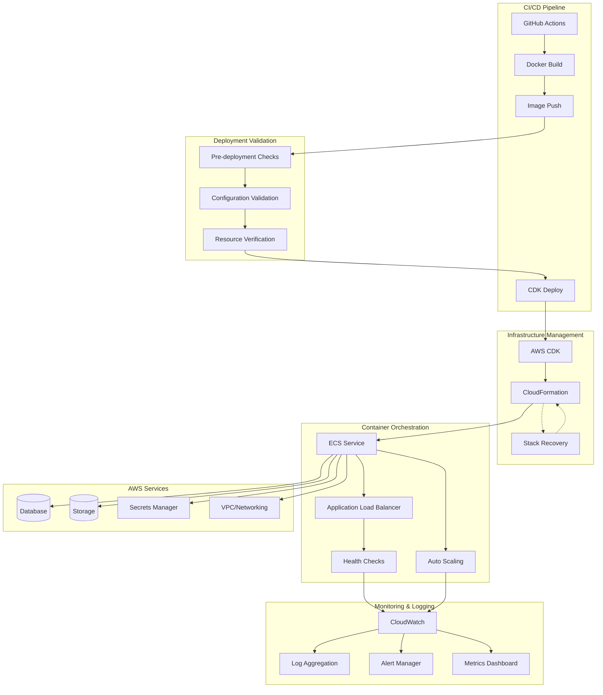

# Design Document

## Overview

The Deployment Infrastructure Reliability system is designed to solve critical AWS ECS deployment failures through systematic configuration management, automated recovery procedures, and comprehensive monitoring. The design addresses the specific issues identified in the court case management system deployment, including ECS service timeout failures, CloudFormation stack recovery, and container startup problems.

The system follows a layered approach with deployment validation, infrastructure management, container orchestration, and monitoring components. Key design decisions include implementing robust health checks, automated resource scaling, and comprehensive error recovery mechanisms to ensure reliable deployments.

## Architecture

### High-Level Architecture



### Component Architecture

The system is organized into four main layers:

- **Deployment Pipeline**: GitHub Actions, Docker build/push, CDK deployment
- **Validation Layer**: Pre-deployment checks, configuration validation, resource verification
- **Infrastructure Layer**: CloudFormation stack management, ECS service configuration, networking
- **Monitoring Layer**: Health checks, logging, metrics, alerting

## Components and Interfaces

### Deployment Pipeline Components

**GitHub Actions Workflow**

- Multi-stage deployment with validation gates
- Parallel Docker image building for backend and media services
- Automated rollback on deployment failure
- Deployment artifact preservation

**CDK Infrastructure Management**

- Declarative infrastructure definition with TypeScript
- Environment-specific configuration management
- Resource dependency management and ordering
- Stack update and rollback capabilities

### Container Configuration Components

**ECS Service Configuration**

```typescript
interface ECSServiceConfig {
  serviceName: string;
  taskDefinition: TaskDefinitionConfig;
  desiredCount: number;
  healthCheckGracePeriod: number;
  deploymentConfiguration: DeploymentConfig;
  networkConfiguration: NetworkConfig;
}

interface TaskDefinitionConfig {
  cpu: number;
  memory: number;
  containerDefinitions: ContainerDefinition[];
  executionRole: string;
  taskRole: string;
}

interface ContainerDefinition {
  name: string;
  image: string;
  portMappings: PortMapping[];
  environment: EnvironmentVariable[];
  healthCheck: HealthCheckConfig;
  logging: LoggingConfig;
}
```

**Health Check Configuration**

```typescript
interface HealthCheckConfig {
  command: string[];
  interval: number;
  timeout: number;
  retries: number;
  startPeriod: number;
}

interface LoadBalancerHealthCheck {
  path: string;
  port: number;
  protocol: string;
  healthyThreshold: number;
  unhealthyThreshold: number;
  timeout: number;
  interval: number;
}
```

### Infrastructure Management Components

**CloudFormation Stack Recovery**

```typescript
class StackRecoveryManager {
  async detectFailedStacks(): Promise<FailedStack[]>;
  async analyzeFailureReason(stackName: string): Promise<FailureAnalysis>;
  async cleanupFailedResources(stackName: string): Promise<CleanupResult>;
  async retryDeployment(
    stackName: string,
    config: DeploymentConfig
  ): Promise<DeploymentResult>;
}

interface FailureAnalysis {
  failedResources: ResourceFailure[];
  rootCause: string;
  recommendedActions: string[];
  canAutoRecover: boolean;
}
```

**Resource Allocation Manager**

```typescript
class ResourceAllocationManager {
  async calculateOptimalResources(
    appMetrics: ApplicationMetrics
  ): Promise<ResourceAllocation>;
  async validateResourceAvailability(
    allocation: ResourceAllocation
  ): Promise<ValidationResult>;
  async scaleResources(
    serviceName: string,
    newAllocation: ResourceAllocation
  ): Promise<ScalingResult>;
}

interface ResourceAllocation {
  cpu: number;
  memory: number;
  networkBandwidth: number;
  storageIOPS: number;
}
```

### Monitoring and Diagnostics Components

**Deployment Monitor**

```typescript
class DeploymentMonitor {
  async trackDeploymentProgress(
    deploymentId: string
  ): Promise<DeploymentStatus>;
  async validateServiceHealth(serviceName: string): Promise<HealthStatus>;
  async generateDiagnosticReport(
    serviceName: string
  ): Promise<DiagnosticReport>;
}

interface DeploymentStatus {
  phase: DeploymentPhase;
  progress: number;
  estimatedCompletion: Date;
  issues: DeploymentIssue[];
}

interface HealthStatus {
  overall: HealthState;
  containers: ContainerHealth[];
  loadBalancer: LoadBalancerHealth;
  dependencies: DependencyHealth[];
}
```

**Log Aggregation Service**

```typescript
class LogAggregationService {
  async collectDeploymentLogs(deploymentId: string): Promise<LogCollection>;
  async analyzeErrorPatterns(logs: LogCollection): Promise<ErrorAnalysis>;
  async generateTroubleshootingGuide(
    errorAnalysis: ErrorAnalysis
  ): Promise<TroubleshootingGuide>;
}
```

## Data Models

### Deployment Configuration Models

**Deployment Specification**

```typescript
interface DeploymentSpec {
  id: string;
  applicationName: string;
  environment: Environment;
  version: string;
  infrastructure: InfrastructureConfig;
  containers: ContainerConfig[];
  networking: NetworkConfig;
  monitoring: MonitoringConfig;
  createdAt: Date;
  createdBy: string;
}

interface InfrastructureConfig {
  region: string;
  availabilityZones: string[];
  vpcConfig: VPCConfig;
  databaseConfig: DatabaseConfig;
  storageConfig: StorageConfig;
}

interface ContainerConfig {
  name: string;
  image: string;
  tag: string;
  resources: ResourceRequirements;
  environment: EnvironmentConfig;
  healthCheck: HealthCheckConfig;
  scaling: ScalingConfig;
}
```

### Monitoring and Metrics Models

**Deployment Metrics**

```typescript
interface DeploymentMetrics {
  deploymentId: string;
  startTime: Date;
  endTime?: Date;
  duration?: number;
  status: DeploymentStatus;
  phases: DeploymentPhase[];
  resourceUtilization: ResourceMetrics;
  errorCount: number;
  warningCount: number;
}

interface ResourceMetrics {
  cpuUtilization: number;
  memoryUtilization: number;
  networkIO: NetworkMetrics;
  diskIO: DiskMetrics;
  databaseConnections: number;
}
```

### Error and Recovery Models

**Failure Analysis**

```typescript
interface FailureRecord {
  id: string;
  deploymentId: string;
  timestamp: Date;
  component: string;
  errorType: ErrorType;
  errorMessage: string;
  stackTrace?: string;
  context: FailureContext;
  resolution?: ResolutionAction;
}

interface ResolutionAction {
  action: string;
  parameters: Record<string, any>;
  automatable: boolean;
  estimatedTime: number;
  successProbability: number;
}
```

## Correctness Properties

_A property is a characteristic or behavior that should hold true across all valid executions of a system—essentially, a formal statement about what the system should do. Properties serve as the bridge between human-readable specifications and machine-verifiable correctness guarantees._

### Property 1: ECS Service Startup Reliability

_For any_ ECS service deployment with valid configuration, the service should start successfully within the specified timeout period and pass all health checks.
**Validates: Requirements 1.1, 1.3**

### Property 2: Container Resource Allocation

_For any_ container deployment, if the allocated resources meet the minimum requirements, the container should start successfully and maintain stable operation.
**Validates: Requirements 2.1, 4.1**

### Property 3: Health Check Validation

_For any_ deployed service with configured health checks, the health check endpoint should return successful responses when the service is operational.
**Validates: Requirements 1.3, 2.3, 6.1**

### Property 4: CloudFormation Stack Recovery

_For any_ CloudFormation stack in ROLLBACK_FAILED state, the automated recovery process should successfully clean up resources and enable retry deployment.
**Validates: Requirements 3.1, 3.2, 3.4**

### Property 5: Deployment Retry Resilience

_For any_ deployment failure due to transient issues, the retry mechanism should successfully complete the deployment with exponential backoff.
**Validates: Requirements 5.1, 5.4**

### Property 6: Database Connectivity Validation

_For any_ application requiring database access, the deployment should verify database connectivity before marking the service as healthy.
**Validates: Requirements 7.1, 7.4**

### Property 7: Security Group Configuration

_For any_ deployed service, the security groups should allow required traffic while blocking unauthorized access.
**Validates: Requirements 8.1, 8.4**

### Property 8: Resource Optimization

_For any_ service deployment, the allocated resources should be sufficient for stable operation without significant over-provisioning.
**Validates: Requirements 4.2, 4.3**

### Property 9: Deployment Validation

_For any_ completed deployment, the validation tests should confirm that all critical functionality is working correctly.
**Validates: Requirements 9.1, 9.2, 9.4**

### Property 10: Log Aggregation Completeness

_For any_ deployment process, all relevant logs should be collected and made available for troubleshooting.
**Validates: Requirements 10.1, 10.3**

### Property 11: CDK Parameter Compatibility

_For any_ CDK infrastructure code, all parameters used in constructs should be compatible with the target CDK version and not cause deployment failures.
**Validates: Requirements 11.1, 11.2, 11.3**

## Error Handling

### Error Classification

**Infrastructure Errors**

- CloudFormation stack failures and resource conflicts
- ECS service startup timeouts and container crashes
- Network connectivity and security group misconfigurations
- Resource allocation and capacity constraints

**Application Errors**

- Container startup failures and health check failures
- Database connection errors and migration failures
- Configuration errors and missing environment variables
- Application binding and port configuration issues

**Pipeline Errors**

- Docker image build and push failures
- GitHub Actions workflow timeouts and failures
- CDK synthesis and deployment errors
- Credential and permission issues

### Error Recovery Strategies

**Automated Recovery**

- Exponential backoff retry for transient failures
- Automatic resource scaling for capacity issues
- Stack cleanup and retry for CloudFormation failures
- Container restart for application crashes

**Manual Intervention Required**

- Configuration errors requiring code changes
- Credential and permission issues
- Network architecture changes
- Database schema conflicts

**Escalation Procedures**

- Alert generation for critical failures
- Diagnostic report generation
- Rollback to previous working version
- Emergency contact notification

## Testing Strategy

### Infrastructure Testing

**Pre-deployment Validation**

- Configuration syntax and semantic validation
- Resource availability and quota checks
- Network connectivity and security validation
- Credential and permission verification

**Deployment Testing**

- Smoke tests for basic service functionality
- Health check validation across all endpoints
- Database connectivity and query testing
- Integration testing with external services

### Property-Based Testing

**Testing Framework**: AWS CDK Testing Framework with Jest
**Test Configuration**: Minimum 50 iterations per property test
**Test Tagging**: Each property test must reference its design document property using the format:
`# Feature: deployment-infrastructure-reliability, Property {number}: {property_text}`

**Example Property Test Structure**:

```typescript
describe("ECS Service Startup Reliability", () => {
  test("Feature: deployment-infrastructure-reliability, Property 1: ECS Service Startup Reliability", async () => {
    const serviceConfig = generateValidServiceConfig();
    const deployment = await deployECSService(serviceConfig);

    expect(deployment.status).toBe("STABLE");
    expect(deployment.healthChecksPassing).toBe(true);
    expect(deployment.startupTime).toBeLessThan(600000); // 10 minutes
  });
});
```

### Monitoring and Validation

**Continuous Monitoring**

- Real-time deployment status tracking
- Resource utilization monitoring
- Error rate and performance metrics
- Availability and uptime tracking

**Automated Validation**

- Post-deployment smoke tests
- API endpoint validation
- Database connectivity verification
- Security configuration auditing

### Test Environment Management

**Isolated Testing**

- Separate AWS accounts for testing
- Isolated VPCs and networking
- Test-specific resource allocation
- Automated cleanup procedures

**Synthetic Data**

- Realistic deployment configurations
- Various failure scenarios
- Performance and load testing data
- Security testing scenarios
