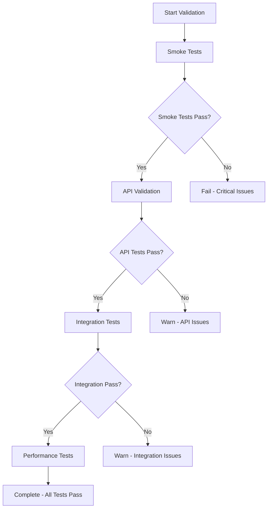

# Deployment Reliability Guide

## Overview

This guide provides comprehensive documentation for the deployment infrastructure reliability system implemented for the Court Case Management System. The system includes automated monitoring, validation, optimization, and disaster recovery capabilities to ensure robust and reliable deployments.

## Table of Contents

1. [Architecture Overview](#architecture-overview)
2. [Deployment Orchestration](#deployment-orchestration)
3. [Monitoring and Alerting](#monitoring-and-alerting)
4. [Health Monitoring](#health-monitoring)
5. [Diagnostic Tools](#diagnostic-tools)
6. [Resource Optimization](#resource-optimization)
7. [Deployment Validation](#deployment-validation)
8. [Disaster Recovery](#disaster-recovery)
9. [Troubleshooting Procedures](#troubleshooting-procedures)
10. [Emergency Procedures](#emergency-procedures)
11. [Configuration Management](#configuration-management)
12. [API Reference](#api-reference)

## Architecture Overview

The deployment reliability system consists of seven integrated services that work together to provide comprehensive deployment lifecycle management:

```
┌─────────────────────────────────────────────────────────────────┐
│                 Deployment Orchestration Service                │
├─────────────────────────────────────────────────────────────────┤
│  ┌─────────────┐  ┌─────────────┐  ┌─────────────┐  ┌─────────┐ │
│  │ Monitoring  │  │   Health    │  │ Diagnostics │  │Resource │ │
│  │  Service    │  │  Service    │  │   Service   │  │Optimize │ │
│  └─────────────┘  └─────────────┘  └─────────────┘  └─────────┘ │
│  ┌─────────────┐  ┌─────────────┐                               │
│  │ Validation  │  │  Disaster   │                               │
│  │  Service    │  │  Recovery   │                               │
│  └─────────────┘  └─────────────┘                               │
└─────────────────────────────────────────────────────────────────┘
```

### Core Services

1. **Deployment Orchestration Service**: Unified orchestration of all reliability components
2. **Deployment Monitoring Service**: CloudWatch metrics collection and dashboard creation
3. **Comprehensive Health Service**: Multi-level health checks and performance monitoring
4. **Diagnostic Service**: Automated issue detection and troubleshooting guidance
5. **Resource Optimization Service**: Automated resource optimization recommendations
6. **Deployment Validation Service**: Comprehensive testing and validation
7. **Disaster Recovery Service**: Rollback capabilities and emergency procedures

## Deployment Orchestration

The Deployment Orchestration Service provides unified management of the entire deployment lifecycle through five phases:

### Phase 1: Pre-Deployment Validation

**Duration**: 2-5 minutes

**Activities**:

- Create deployment snapshot for rollback capability
- Run comprehensive diagnostic checks
- Validate current service health
- Check for critical issues that would block deployment

**Success Criteria**:

- No critical issues found
- Service health score ≥ 70%
- Deployment snapshot created successfully
- **Architecture Validation**: Docker images must be built for `linux/amd64` (x86_64) to ensure compatibility with AWS Fargate nodes. Builds on ARM64 (Apple Silicon) machines MUST use the `--platform linux/amd64` flag.

**API Endpoint**: `POST /api/v1/deployment-orchestration/orchestrate/{cluster_name}/{service_name}`

### Phase 2: Deployment Monitoring

**Duration**: 5-15 minutes

**Activities**:

- Monitor service health during deployment
- Wait for service to become healthy
- Validate service startup and readiness

**Success Criteria**:

- Service reaches healthy state within timeout
- All health checks pass
- No deployment failures detected

### Phase 3: Post-Deployment Validation

**Duration**: 3-10 minutes

**Activities**:

- Run smoke tests for basic functionality
- Validate API endpoints
- Test integration with external services
- Create post-deployment snapshot

**Success Criteria**:

- Validation success rate ≥ 90%
- All critical tests pass
- Post-deployment snapshot created

### Phase 4: Monitoring Setup

**Duration**: 1-3 minutes

**Activities**:

- Setup CloudWatch dashboards
- Configure automated alerting
- Enable continuous health monitoring

**Success Criteria**:

- Monitoring dashboards created
- Alerts configured and active
- Health monitoring enabled

### Phase 5: Optimization Analysis

**Duration**: 2-5 minutes

**Activities**:

- Analyze resource utilization patterns
- Generate optimization recommendations
- Identify cost savings opportunities

**Success Criteria**:

- Resource analysis completed
- Optimization recommendations generated
- Performance baseline established

## Monitoring and Alerting

### CloudWatch Integration

The monitoring system integrates with AWS CloudWatch to collect and analyze metrics:

**ECS Metrics**:

- CPU utilization
- Memory utilization
- Network I/O
- Task count and health

**ALB Metrics**:

- Request count
- Response times
- Error rates (4xx, 5xx)
- Target health

**RDS Metrics**:

- Database connections
- CPU and memory usage
- Read/write IOPS
- Query performance

### Dashboard Configuration

Automated dashboard creation includes:

```yaml
Dashboard Widgets:
  - ECS Service Overview
  - Application Load Balancer Metrics
  - Database Performance
  - Error Rate Trends
  - Response Time Distribution
  - Resource Utilization
```

### Alerting Rules

**Critical Alerts** (Immediate notification):

- Service unavailable (0 healthy tasks)
- Error rate > 10%
- Response time > 5 seconds
- Database connection failures

**Warning Alerts** (5-minute delay):

- CPU utilization > 80%
- Memory utilization > 85%
- Error rate > 5%
- Response time > 2 seconds

**API Endpoints**:

- `GET /api/v1/monitoring/dashboard/{cluster_name}/{service_name}`
- `POST /api/v1/monitoring/alerts/setup`
- `GET /api/v1/monitoring/metrics/{cluster_name}/{service_name}`

## Health Monitoring

### Multi-Level Health Checks

The health monitoring system provides comprehensive health assessment:

**Level 1: Basic Health**

- Application startup status
- Database connectivity
- Redis connectivity
- AWS services availability

**Level 2: Performance Health**

- Response time monitoring
- Resource utilization tracking
- Error rate analysis
- Throughput measurement

**Level 3: Business Logic Health**

- API endpoint functionality
- Data integrity checks
- External service integration
- Feature availability

### Health Scoring System

Health scores are calculated on a 0-100 scale:

```
Score Calculation:
- Basic Health: 40% weight
- Performance Health: 35% weight
- Business Logic Health: 25% weight

Score Ranges:
- 90-100: Excellent
- 80-89: Good
- 70-79: Fair
- 60-69: Poor
- 0-59: Critical
```

### Anomaly Detection

Automated anomaly detection monitors:

- Response time trends
- Error rate patterns
- Resource utilization spikes
- Performance degradation

**API Endpoints**:

- `GET /api/v1/health/comprehensive`
- `GET /api/v1/health/score`
- `GET /api/v1/health/anomalies`

## Diagnostic Tools

### Automated Issue Detection

The diagnostic service automatically detects and categorizes issues:

**Infrastructure Issues**:

- ECS service failures
- Load balancer problems
- Database connectivity issues
- Network configuration problems

**Application Issues**:

- High error rates
- Performance degradation
- Memory leaks
- Configuration errors

**Security Issues**:

- Authentication failures
- Authorization problems
- SSL/TLS issues
- Security group misconfigurations

### Guided Troubleshooting

For each detected issue, the system provides:

1. **Issue Description**: Clear explanation of the problem
2. **Impact Assessment**: Severity and affected components
3. **Root Cause Analysis**: Potential causes and contributing factors
4. **Resolution Steps**: Step-by-step troubleshooting guide
5. **Prevention Measures**: Recommendations to prevent recurrence

### Log Aggregation

Integrated CloudWatch Logs analysis:

- Error pattern detection
- Log correlation across services
- Performance bottleneck identification
- Security event monitoring

**API Endpoints**:

- `GET /api/v1/diagnostics/run-diagnostics`
- `GET /api/v1/diagnostics/issues`
- `GET /api/v1/diagnostics/troubleshooting/{issue_id}`

## Resource Optimization

### Automated Analysis

The optimization service analyzes resource usage patterns and provides recommendations:

**CPU Optimization**:

- Utilization pattern analysis
- Right-sizing recommendations
- Cost optimization opportunities
- Performance impact assessment

**Memory Optimization**:

- Memory usage trends
- Allocation recommendations
- Memory leak detection
- Performance optimization

**Scaling Optimization**:

- Auto-scaling configuration
- Load pattern analysis
- Capacity planning
- Cost-performance balance

### Recommendation Engine

Optimization recommendations include:

```yaml
Recommendation Types:
  - Scale Up: Increase resources for performance
  - Scale Down: Reduce resources for cost savings
  - Right-Size: Optimize resource allocation
  - Auto-Scale: Configure automatic scaling
```

**Confidence Scoring**:

- High (90-100%): Strong recommendation based on clear patterns
- Medium (70-89%): Good recommendation with some uncertainty
- Low (50-69%): Tentative recommendation requiring validation

### Cost Analysis

Cost optimization features:

- Resource cost breakdown
- Savings opportunity identification
- ROI analysis for changes
- Budget impact assessment

**API Endpoints**:

- `GET /api/v1/resource-optimization/analyze/{cluster_name}/{service_name}`
- `GET /api/v1/resource-optimization/recommendations/{cluster_name}/{service_name}`
- `POST /api/v1/resource-optimization/apply/{cluster_name}/{service_name}`

## Deployment Validation

### Test Categories

**Smoke Tests**: Basic functionality validation

- Health endpoint availability
- Application startup verification
- Basic API accessibility
- Documentation availability

**API Validation Tests**: Endpoint functionality

- API v1 root endpoint
- Core business endpoints (cases, documents)
- Monitoring endpoints
- Authentication endpoints

**Integration Tests**: External service connectivity

- Database connectivity
- Redis connectivity
- AWS services integration
- S3 bucket access

**Performance Tests**: Load and performance validation

- Concurrent request handling
- Response time measurement
- Throughput analysis
- Error rate under load

### Validation Workflow



### Test Configuration

```yaml
Test Timeouts:
  - Smoke Tests: 10 seconds
  - API Tests: 15 seconds
  - Integration Tests: 30 seconds
  - Performance Tests: 60 seconds

Retry Logic:
  - Critical Tests: 3 retries
  - Non-Critical Tests: 1 retry
  - Exponential Backoff: 2^attempt seconds
```

**API Endpoints**:

- `POST /api/v1/deployment-validation/validate/{cluster_name}/{service_name}`
- `POST /api/v1/deployment-validation/smoke-test/{cluster_name}/{service_name}`
- `POST /api/v1/deployment-validation/performance-test`

## Disaster Recovery

### Snapshot Management

Automated deployment snapshots provide rollback capability:

**Snapshot Contents**:

- ECS service configuration
- Task definition details
- Load balancer settings
- Auto-scaling configuration
- Environment variables
- Network configuration

**Retention Policy**:

- Maximum 10 snapshots per service
- 30-day retention period
- Automatic cleanup of old snapshots
- S3 versioning for backup redundancy

### Recovery Plans

**Service Rollback Plan**:

- Estimated RTO: 5 minutes
- Estimated RPO: 0 minutes
- Automatic execution on critical failures
- No approval required

**Emergency Scaling Plan**:

- Estimated RTO: 3 minutes
- Estimated RPO: 0 minutes
- Triggered by resource exhaustion
- Automatic execution enabled

**Infrastructure Recovery Plan**:

- Estimated RTO: 60 minutes
- Estimated RPO: 15 minutes
- Full infrastructure recreation
- Approval required

### Rollback Procedures

**Automatic Rollback Triggers**:

- Deployment validation failure
- Critical health check failures
- Error rate > 25%
- Service unavailability > 5 minutes

**Manual Rollback Process**:

1. Identify target snapshot
2. Validate rollback safety
3. Execute rollback operation
4. Monitor rollback progress
5. Validate service health

### Remote Database Migration

For RDS instances isolated in private subnets, migrations must be executed via one-off ECS Fargate tasks using the backend image with a command override.

**Procedure**:
1. Build and push the `linux/amd64` backend image.
2. Trigger an ECS `run-task` command with security groups allowed to access the RDS.
3. Command override: `["alembic", "upgrade", "head"]` or `["alembic", "stamp", "head"]`.

> [!IMPORTANT]
> **SSL Requirement**: The production RDS instance strictly requires encrypted connections. 
> - For Alembic, the `sqlalchemy.url` in `alembic.ini` or the environment-provided URL must include `?ssl=require` (or correspond to `ssl_mode=require` in asyncpg).
> - For manual scripts, ensure the DSN includes `ssl=require` to prevent `no pg_hba.conf entry` errors.

**Monitoring Migration Status**:
- Status: `GET /health/ready`
- Details: `migrations` object in response.

**API Endpoints**:

- `POST /api/v1/disaster-recovery/snapshot/{cluster_name}/{service_name}`
- `GET /api/v1/disaster-recovery/snapshots/{cluster_name}/{service_name}`
- `POST /api/v1/disaster-recovery/rollback/{cluster_name}/{service_name}`

## Troubleshooting Procedures

### Common Issues and Solutions

#### 1. Service Deployment Failures

**Symptoms**:

- ECS service stuck in deployment
- Tasks failing to start
- Health checks failing

**Diagnostic Steps**:

1. Check ECS service events
2. Review task definition configuration
3. Validate security group rules
4. Check resource availability

**Resolution**:

```bash
# Check service status
aws ecs describe-services --cluster <cluster> --services <service>

# Review task failures
aws ecs describe-tasks --cluster <cluster> --tasks <task-arn>

# Check logs
aws logs get-log-events --log-group-name /ecs/<service>
```

#### 2. High Error Rates

**Symptoms**:

- 4xx/5xx error rate > 5%
- Application exceptions
- Database connection errors

**Diagnostic Steps**:

1. Review application logs
2. Check database connectivity
3. Validate API endpoints
4. Monitor resource utilization

**Resolution**:

```bash
# Check application logs
GET /api/v1/diagnostics/logs?level=error

# Run health diagnostics
GET /api/v1/diagnostics/run-diagnostics

# Check database status
GET /api/v1/health/database
```

#### 3. Performance Degradation

**Symptoms**:

- Response times > 2 seconds
- High CPU/memory utilization
- Slow database queries

**Diagnostic Steps**:

1. Analyze performance metrics
2. Check resource utilization
3. Review database performance
4. Identify bottlenecks

**Resolution**:

```bash
# Get optimization recommendations
GET /api/v1/resource-optimization/recommendations/<cluster>/<service>

# Analyze performance trends
GET /api/v1/monitoring/metrics/<cluster>/<service>

# Emergency scaling if needed
POST /api/v1/disaster-recovery/emergency-scale/<cluster>/<service>
```

### Escalation Procedures

**Level 1: Automated Response**

- Automatic diagnostics
- Self-healing attempts
- Alert notifications

**Level 2: Operations Team**

- Manual investigation
- Advanced troubleshooting
- Coordination with development

**Level 3: Engineering Team**

- Code-level investigation
- Architecture review
- Long-term fixes

## Emergency Procedures

### Critical Service Failure

**Immediate Actions** (0-5 minutes):

1. Assess impact and scope
2. Check automated recovery status
3. Notify stakeholders
4. Activate incident response

**Short-term Response** (5-30 minutes):

1. Execute emergency rollback if needed
2. Scale resources if required
3. Implement workarounds
4. Monitor recovery progress

**Long-term Response** (30+ minutes):

1. Root cause analysis
2. Permanent fix implementation
3. Post-incident review
4. Process improvements

### Emergency Contacts

```yaml
Operations Team:
  - Primary: ops-team@company.com
  - Phone: +1-555-OPS-TEAM
  - Slack: #ops-emergency

Engineering Team:
  - Primary: dev-team@company.com
  - Phone: +1-555-DEV-TEAM
  - Slack: #dev-emergency

Management:
  - Primary: management@company.com
  - Phone: +1-555-MGMT
```

### Emergency Commands

**Immediate Rollback**:

```bash
# Get latest snapshot
GET /api/v1/disaster-recovery/snapshots/<cluster>/<service>

# Execute rollback
POST /api/v1/disaster-recovery/rollback/<cluster>/<service>
{
  "snapshot_id": "20240112_143000",
  "dry_run": false
}
```

**Emergency Scaling**:

```bash
# Scale up immediately
POST /api/v1/disaster-recovery/emergency-scale/<cluster>/<service>
{
  "target_count": 10,
  "reason": "Critical performance issue"
}
```

**Service Health Check**:

```bash
# Quick health assessment
GET /api/v1/health/comprehensive

# Detailed diagnostics
GET /api/v1/diagnostics/run-diagnostics
```

## Configuration Management

### Environment Variables

**Required Configuration**:

```bash
# AWS Configuration
AWS_REGION=us-west-2
AWS_ACCESS_KEY_ID=<access-key>
AWS_SECRET_ACCESS_KEY=<secret-key>

# Service Configuration
CLUSTER_NAME=CourtCaseCluster
SERVICE_NAME=BackendService

# Monitoring Configuration
CLOUDWATCH_NAMESPACE=CourtCase/Production
ALERT_SNS_TOPIC=arn:aws:sns:us-west-2:123456789012:alerts

# Backup Configuration
BACKUP_BUCKET=court-case-disaster-recovery-backups
SNAPSHOT_RETENTION_DAYS=30
```

### Service Configuration

**Orchestration Service**:

```yaml
auto_optimization_enabled: true
auto_recovery_enabled: true
validation_timeout_minutes: 10
monitoring_interval_minutes: 5
```

**Monitoring Service**:

```yaml
dashboard_refresh_interval: 300
metric_collection_interval: 60
alert_evaluation_period: 300
```

**Health Service**:

```yaml
health_check_interval: 30
anomaly_detection_enabled: true
performance_threshold_ms: 2000
```

### API Configuration

All services are accessible through the unified API at `/api/v1/`:

```
Base URL: https://<load-balancer-dns>/api/v1/

Service Endpoints:
- /deployment-orchestration/
- /monitoring/
- /health/
- /diagnostics/
- /resource-optimization/
- /deployment-validation/
- /disaster-recovery/
```

## API Reference

### Deployment Orchestration

**Orchestrate Full Deployment**:

```http
POST /api/v1/deployment-orchestration/orchestrate/{cluster_name}/{service_name}
Content-Type: application/json

{
  "deployment_config": {
    "validation_timeout_minutes": 10,
    "enable_auto_recovery": true
  }
}
```

**Get Orchestration Status**:

```http
GET /api/v1/deployment-orchestration/status/{cluster_name}/{service_name}
```

### Monitoring

**Get Deployment Metrics**:

```http
GET /api/v1/monitoring/metrics/{cluster_name}/{service_name}?hours_back=24
```

**Setup Monitoring Dashboard**:

```http
POST /api/v1/monitoring/dashboard/{cluster_name}/{service_name}
```

### Health Monitoring

**Get Comprehensive Health**:

```http
GET /api/v1/health/comprehensive
```

**Get Health Score**:

```http
GET /api/v1/health/score
```

### Diagnostics

**Run Diagnostics**:

```http
GET /api/v1/diagnostics/run-diagnostics
```

**Get Troubleshooting Guide**:

```http
GET /api/v1/diagnostics/troubleshooting/{issue_id}
```

### Resource Optimization

**Analyze Resource Usage**:

```http
GET /api/v1/resource-optimization/analyze/{cluster_name}/{service_name}?hours_back=24
```

**Get Recommendations**:

```http
GET /api/v1/resource-optimization/recommendations/{cluster_name}/{service_name}
```

### Deployment Validation

**Validate Deployment**:

```http
POST /api/v1/deployment-validation/validate/{cluster_name}/{service_name}
```

**Run Performance Tests**:

```http
POST /api/v1/deployment-validation/performance-test
Content-Type: application/json

{
  "base_url": "http://load-balancer-dns",
  "concurrent_requests": 10,
  "duration_seconds": 60
}
```

### Disaster Recovery

**Create Snapshot**:

```http
POST /api/v1/disaster-recovery/snapshot/{cluster_name}/{service_name}
```

**Execute Rollback**:

```http
POST /api/v1/disaster-recovery/rollback/{cluster_name}/{service_name}
Content-Type: application/json

{
  "snapshot_id": "20240112_143000",
  "dry_run": false
}
```

**Emergency Scaling**:

```http
POST /api/v1/disaster-recovery/emergency-scale/{cluster_name}/{service_name}
Content-Type: application/json

{
  "target_count": 5,
  "reason": "Emergency scaling due to high load"
}
```

## Best Practices

### Deployment Best Practices

1. **Always create snapshots** before major deployments
2. **Run validation tests** in staging environment first
3. **Monitor deployments** actively during rollout
4. **Have rollback plan** ready before deployment
5. **Test disaster recovery** procedures regularly

### Monitoring Best Practices

1. **Set appropriate thresholds** for alerts
2. **Monitor business metrics** not just technical metrics
3. **Use dashboards** for visual monitoring
4. **Review metrics regularly** for trends
5. **Tune alerting** to reduce noise

### Performance Best Practices

1. **Monitor resource utilization** continuously
2. **Apply optimization recommendations** regularly
3. **Load test** before production deployment
4. **Scale proactively** based on trends
5. **Review performance** after each deployment

### Security Best Practices

1. **Use least privilege** for IAM roles
2. **Encrypt data** in transit and at rest
3. **Monitor security events** continuously
4. **Regular security audits** of configurations
5. **Keep dependencies** up to date

## Conclusion

This deployment reliability system provides comprehensive coverage of the deployment lifecycle with automated monitoring, validation, optimization, and recovery capabilities. The integrated approach ensures robust and reliable deployments while minimizing manual intervention and reducing the risk of service disruptions.

For additional support or questions, contact the operations team at ops-team@company.com or refer to the troubleshooting procedures in this guide.
